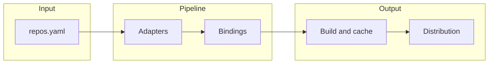

<div align="center">

# Universal Recycle

**Manifest-driven workflows for syncing, modernizing, and building polyglot repositories.**

[Installation](docs/installation.md) · [Quick start](docs/quickstart.md) · [CLI reference](docs/cli-reference.md) · [Plugins](docs/plugins.md)

[](LICENSE)
[](https://www.python.org/)
[](https://github.com/fraware/universal-recycle)

</div>

---

Universal Recycle is a **CLI and Python package** that reads a single manifest (`repos.yaml`), clones upstream projects into a local **`repos/`** directory, runs **adapters** (linters, formatters, checks), can orchestrate **bindings** and **build** steps, and supports **plugins** and optional remote **caching**. It fits teams that want one entry point across Python, C++, Rust, Go, and WebAssembly-style workflows—without giving up reproducibility goals (Bazel-oriented hooks, profiles, cache keys).

| | |
| :--- | :--- |
| **Status** | `0.1.0` — alpha; CLI, validation, and adapters are still evolving |
| **Install** | `pip install -e ".[dev]"` from a clone, or see [PyPI / pipx](docs/installation.md) |
| **CLI** | `recycle` (or `python -m recycle` with the same arguments) |
| **Security** | Report issues privately — [SECURITY.md](SECURITY.md) |

---

## Quick start

```bash
git clone https://github.com/fraware/universal-recycle.git
cd universal-recycle
pip install -e ".[dev]"

recycle init
recycle sync
recycle build --target my-project
```

Clones land in **`./repos`** (gitignored in this repo). Optional extras (`grpc`, bindings, cloud caches, etc.) are declared in [`pyproject.toml`](pyproject.toml).

For a guided tour, see the **[5-minute tutorial](docs/quickstart.md)**.

---

## What you get

| Area | Highlights |
| :--- | :--- |
| **Languages** | Python, C++, Rust, Go, WASM-oriented flows; adapters vary by language |
| **Manifest** | List or `repositories:` YAML; per-repo `git`, `commit`, `adapters`, `bindings` |
| **Build** | Profiles, Bazel helpers, build graph / simulation style commands |
| **Caching** | Local and optional Redis / S3 / GCS backends (install extras as needed) |
| **Extensibility** | Plugin manifests under `plugins/`, packaged templates, binding generators |

<details>
<summary><strong>Enterprise-oriented commands</strong> (team, CI/CD, performance)</summary>

These subcommands exist in the CLI; behavior and prerequisites depend on your setup. Treat them as **experimental** until your environment is wired up.

```bash
recycle team --team-command add-user --username alice --role member
recycle team --team-command create-workspace --workspace-name production

recycle cicd --cicd-command create-pipeline --pipeline-name production
recycle cicd --cicd-command add-webhook --webhook-url https://hooks.slack.com/...

recycle performance --performance-command monitor
recycle performance --performance-command report --output html
```

</details>

---

## Example manifest and commands

```yaml
# repos.yaml
repositories:
  - name: my-python-lib
    language: python
    git: https://github.com/org/my-python-lib
    commit: main
    adapters: [ruff, mypy]

  - name: my-cpp-lib
    language: cpp
    git: https://github.com/org/my-cpp-lib
    commit: v1.0.0
    adapters: [clang_tidy, vcpkg_manifest]
```

```bash
recycle sync
recycle adapt
recycle bind --generators pybind11 grpc
recycle build --target my-cpp-lib --profile release --bazel
recycle distribute --target my-python-lib
```

Adapter names must match the [built-in registry](recycle/plugin.py) (for example `clang_tidy`, not `clang-tidy`, unless you add a plugin).

---

## Architecture



At a high level: **manifest → adapters → bindings → build/cache → distribution**. The CLI ties these stages together; heavy tools (compilers, Bazel, cloud SDKs) are expected on the host or in your CI image when you opt into them.

---

## Plugins

```bash
recycle plugin --plugin-command list
recycle plugin --plugin-command install --plugin-path ./plugins/my-custom-adapter
recycle adapt --adapter my-custom-adapter
```

Full conventions and packaging notes: **[Plugin development](docs/plugins.md)**.

---

## Documentation

| Doc | Purpose |
| :--- | :--- |
| [Documentation index](docs/README.md) | Map of all guides |
| [Installation](docs/installation.md) | PyPI, source, Docker, pipx, verification |
| [Quick start](docs/quickstart.md) | First project walkthrough |
| [CLI reference](docs/cli-reference.md) | Every command and flag |
| [Troubleshooting](docs/troubleshooting.md) | Common failures and fixes |

---

## Contributing

We welcome issues and pull requests. **[CONTRIBUTING.md](CONTRIBUTING.md)** covers setup, `pytest`, Ruff, and Mypy. Quick loop:

```bash
git clone https://github.com/your-username/universal-recycle.git
cd universal-recycle
pip install -e ".[dev]"
pytest
```

---

## Community and support

- [Issues](https://github.com/fraware/universal-recycle/issues)
- [Discussions](https://github.com/fraware/universal-recycle/discussions)
- [support@universal-recycle.org](mailto:support@universal-recycle.org)

---

## License

[MIT](LICENSE)

---

## Roadmap (directional)

- Broader adapter and binding coverage per language  
- Deeper CI and cloud cache ergonomics  
- Clearer “stable” surface for enterprise subcommands  
- Curated plugin examples and optional registry story  
